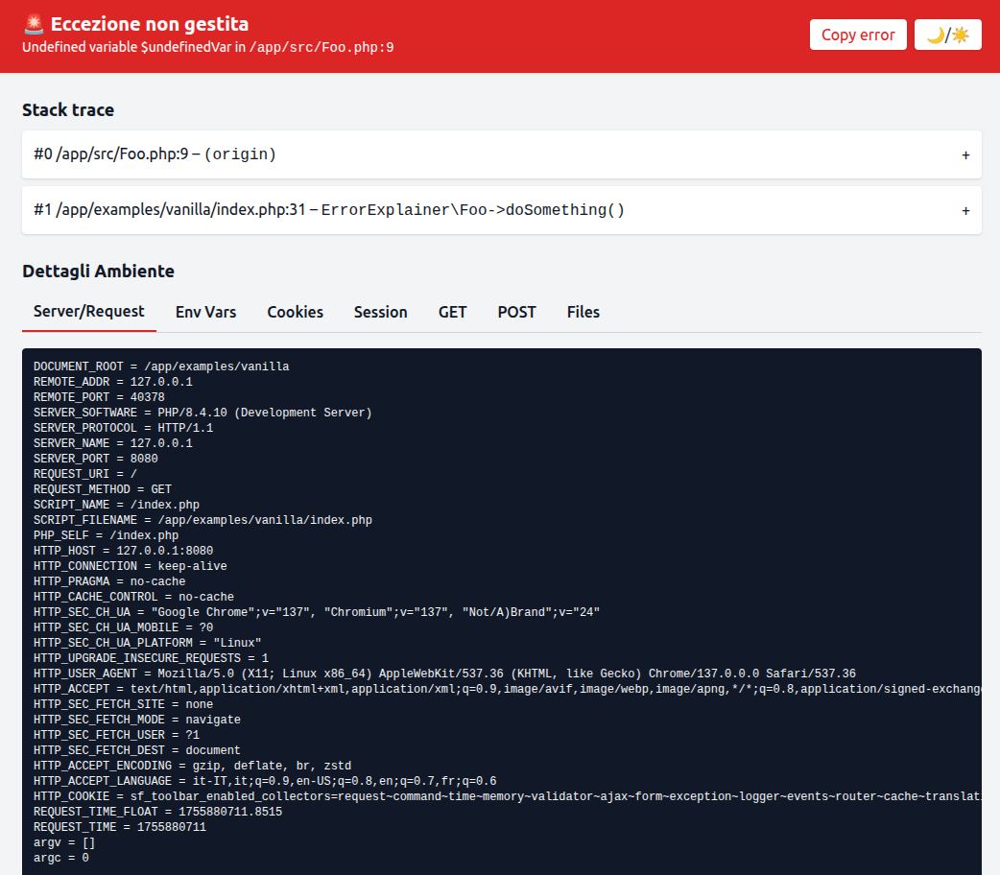
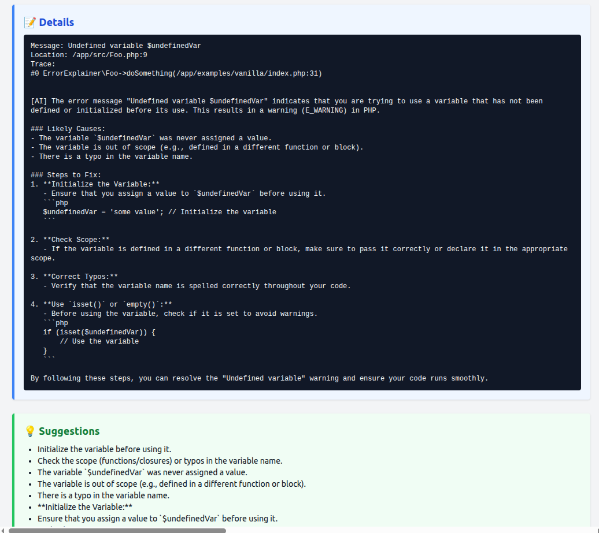

# PHP Error Insight (AI)

A tool that intercepts PHP errors, warnings, and exceptions and provides practical help and advice generated by AI (local models or external APIs). No static text: details and suggestions are created on-the-fly by artificial intelligence based on the error message and context.

Screenshots:




- Supports local AI backends (e.g. Ollama/LocalAI) and APIs (e.g. OpenAI).
- HTML, text or JSON output.
- Simple configuration via environment variables or by instantiating the Config.

## Requirements
- PHP >= 7.4
- Composer
- (Optional) a local AI backend (Ollama/LocalAI) or an API key (OpenAI, etc.)

## Installation

```bash
composer require raffaelecarelle/php-error-insight
```

## Configuration
You can configure the tool via environment variables or through code.

Supported environment variables:
- ERROR_EXPLAINER_ENABLED: true/false (default: true)
- ERROR_EXPLAINER_BACKEND: none|local|api
- ERROR_EXPLAINER_MODEL: model name (e.g. llama3:instruct, gpt-4o-mini)
- ERROR_EXPLAINER_API_KEY: API key (required for api backend)
- ERROR_EXPLAINER_API_URL: service URL (e.g. http://localhost:11434 for Ollama, or https://api.openai.com/v1/chat/completions)
- ERROR_EXPLAINER_LANG: language for AI prompt (it, en, ...; default: it)
- ERROR_EXPLAINER_OUTPUT: auto|html|text|json (default: auto)
- ERROR_EXPLAINER_VERBOSE: true/false (default: false)
- ERROR_EXPLAINER_TEMPLATE: path to a custom HTML template (optional)

Configuration examples:

1) Local backend (Ollama):

```bash
export ERROR_EXPLAINER_BACKEND=local export ERROR_EXPLAINER_MODEL=llama3:instruct export ERROR_EXPLAINER_API_URL=[http://localhost:11434](http://localhost:11434)
```

2) API backend (OpenAI compatible):


```bash
export ERROR_EXPLAINER_BACKEND=api export ERROR_EXPLAINER_MODEL=gpt-4o-mini export ERROR_EXPLAINER_API_KEY=sk-... export ERROR_EXPLAINER_API_URL=[https://api.openai.com/v1/chat/completions](https://api.openai.com/v1/chat/completions)
```

## Usage (Vanilla PHP)
In your application's bootstrap, register the handler included in the examples, or use the helper provided by the package. A minimal example is available in examples/vanilla/index.php.

Quick example:


```php
use ErrorExplainer\Config; use ErrorExplainer\Register;
require **DIR**.'/vendor/autoload.php';
$config = Config::fromEnvAndArray([ 'backend' => 'local', // none | local | api 'model' => 'llama3:instruct', 'language'=> 'en', 'verbose' => true, ]);
Register::install($config); // sets up error and exception handlers
// Generate an error to see the output strpos();
```

Output:
- In HTML you'll see the page with stack trace and the "Details/Suggestions" section populated by AI.
- In CLI you'll get text/JSON depending on configuration.

## How it works
- The tool intercepts errors/warnings/exceptions.
- Builds a prompt with message, severity and location.
- Sends the prompt to the configured AI backend.
- Shows the AI response as details and practical suggestions.

Note: the tool no longer uses static translated texts for details/suggestions. If the AI backend is not configured or doesn't respond, those sections might remain empty.

## Privacy
Avoid sending sensitive data to the backend. You can anonymize messages and paths, or use a local backend.

## License
MIT