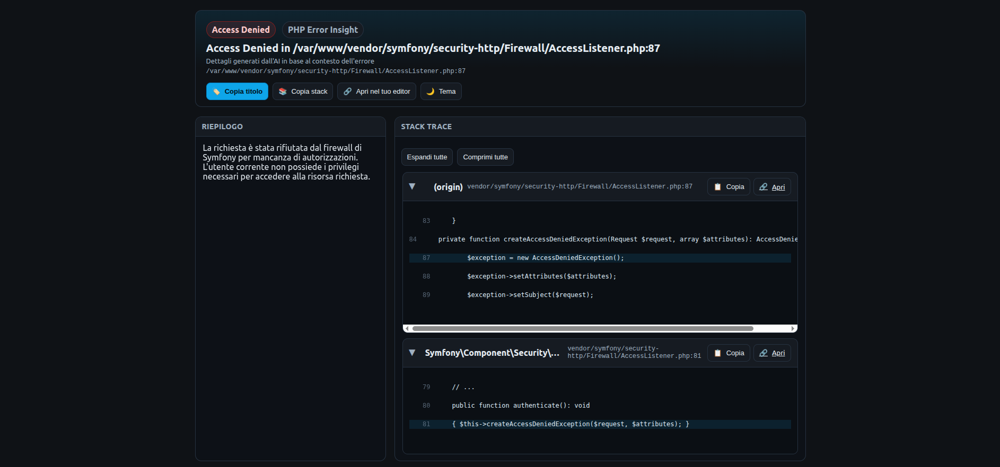

# PHP Error Insight

A tool that intercepts PHP errors, warnings, and exceptions and provides practical help and advice generated by AI (local models or external APIs). No static text: details and suggestions are created on-the-fly by artificial intelligence based on the error message and context.

Screenshots:




- Supports local AI backends (e.g. Ollama/LocalAI) and APIs (e.g. OpenAI, Anthropic, Google Gemini).
- HTML, text or JSON output.
- Simple configuration via environment variables or by instantiating the Config.

## Requirements
- PHP >= 8.1
- Composer
- (Optional) a local AI backend (Ollama/LocalAI) or an API key (OpenAI, etc.)

## Installation

```bash
composer require raffaelecarelle/php-error-insight
```

## Configuration
You can configure the tool via environment variables or through code.

Supported environment variables:
- PHP_ERROR_INSIGHT_ENABLED: true/false (default: true)
- PHP_ERROR_INSIGHT_BACKEND: none|local|api|openai|anthropic|google|gemini
- PHP_ERROR_INSIGHT_MODEL: model name (e.g. llama3:instruct, gpt-4o-mini, claude-3-5-sonnet-20240620, gemini-1.5-flash)
- PHP_ERROR_INSIGHT_API_KEY: API key (required for api/openai/anthropic/google backends)
- PHP_ERROR_INSIGHT_API_URL: service URL (optional override; e.g. http://localhost:11434 for Ollama, https://api.openai.com/v1/chat/completions for OpenAI, https://api.anthropic.com/v1/messages for Anthropic, https://generativelanguage.googleapis.com/v1/models for Google Gemini)
- PHP_ERROR_INSIGHT_LANG: language for AI prompt (it, en, ...; default: it)
- PHP_ERROR_INSIGHT_OUTPUT: auto|html|text|json (default: auto)
- PHP_ERROR_INSIGHT_VERBOSE: true/false (default: false)
- PHP_ERROR_INSIGHT_TEMPLATE: path to a custom HTML template (optional)
- PHP_ERROR_INSIGHT_ROOT: absolute project root to compute relative file paths in the stack (optional)
- PHP_ERROR_INSIGHT_HOST_ROOT: absolute host project root used to map container paths when opening files via editor links (optional; useful in Docker)
- PHP_ERROR_INSIGHT_EDITOR: editor URL template for clickable file links, using %file and %line placeholders (e.g. "vscode://file/%file:%line" or "phpstorm://open?file=%file&line=%line")
- PHP_ERROR_INSIGHT_CONSOLE_COLORS: JSON object to customize console styles (token colors, severity backgrounds, title/suggestions/stack/location).

Configuration examples:

1) Local backend (Ollama):

```bash
export PHP_ERROR_INSIGHT_BACKEND=local export PHP_ERROR_INSIGHT_MODEL=llama3:instruct export PHP_ERROR_INSIGHT_API_URL=[http://localhost:11434](http://localhost:11434)
```

2) API backend (OpenAI compatible):

```bash
export PHP_ERROR_INSIGHT_BACKEND=api
export PHP_ERROR_INSIGHT_MODEL=gpt-4o-mini
export PHP_ERROR_INSIGHT_API_KEY=sk-...
export PHP_ERROR_INSIGHT_API_URL=https://api.openai.com/v1/chat/completions
```

3) API backend (Anthropic Claude):

```bash
export PHP_ERROR_INSIGHT_BACKEND=anthropic
export PHP_ERROR_INSIGHT_MODEL=claude-3-5-sonnet-20240620
export PHP_ERROR_INSIGHT_API_KEY=api-key
# optional override
# export PHP_ERROR_INSIGHT_API_URL=https://api.anthropic.com/v1/messages
```

4) API backend (Google Gemini):

```bash
export PHP_ERROR_INSIGHT_BACKEND=google
export PHP_ERROR_INSIGHT_MODEL=gemini-1.5-flash
export PHP_ERROR_INSIGHT_API_KEY=api-key
# optional override
# export PHP_ERROR_INSIGHT_API_URL=https://generativelanguage.googleapis.com/v1/models
```

## Editor integration and stack trace copying

When viewing the HTML error page, each stack frame now shows:

- Clickable file path: if PHP_ERROR_INSIGHT_EDITOR (or Config::editorUrl) is set, file paths become links that can open your editor at the exact line.
- Per-row copy button: a small clipboard button copies the project-relative path with line in the format `path/to/file.php:LINE`.
- Copy title: a button in the header copies the error title (and location) to your clipboard.
- Copy full stack: a button copies all stack lines as plain text.

Configuration options:
- PHP_ERROR_INSIGHT_ROOT: absolute project root used to compute relative paths.
- PHP_ERROR_INSIGHT_EDITOR: URL template with placeholders %file and %line.
  - VS Code: `vscode://file/%file:%line`
  - PhpStorm: `phpstorm://open?file=%file&line=%line`

Example (VS Code):

```bash
export PHP_ERROR_INSIGHT_ROOT=/path/to/your/project
export PHP_ERROR_INSIGHT_EDITOR="vscode://file/%file:%line"
```

Example (PhpStorm):

```bash
export PHP_ERROR_INSIGHT_ROOT=/path/to/your/project
export PHP_ERROR_INSIGHT_EDITOR="phpstorm://open?file=%file&line=%line"
```

Docker/containers mapping (open files in host IDE):

When running the app inside a container, set PHP_ERROR_INSIGHT_ROOT to the container project root and PHP_ERROR_INSIGHT_HOST_ROOT to the corresponding host path. Editor links will be generated with the host path so your IDE can open files.

Example (Docker + VS Code):

```bash
# inside container, your app root is mounted from /Users/you/project
export PHP_ERROR_INSIGHT_ROOT=/var/www/app
export PHP_ERROR_INSIGHT_HOST_ROOT=/Users/you/project
export PHP_ERROR_INSIGHT_EDITOR="vscode://file/%file:%line"
```

Example (Docker + PhpStorm):

```bash
export PHP_ERROR_INSIGHT_ROOT=/var/www/app
export PHP_ERROR_INSIGHT_HOST_ROOT=/Users/you/project
export PHP_ERROR_INSIGHT_EDITOR="phpstorm://open?file=%file&line=%line"
```

Code-based configuration example:

```php
use ErrorExplainer\Config;

$config = Config::fromEnvAndArray([
    'projectRoot' => __DIR__,
    'editorUrl' => 'vscode://file/%file:%line',
]);
```

Notes:
- If a file is outside the declared project root, the viewer falls back to trimming from `/vendor/` when present, or shows a normalized absolute path.
- All clipboard features use a secure helper that falls back to a hidden textarea when the Clipboard API is not available.

## Usage (Vanilla PHP)
In your application's bootstrap, register the handler included in the examples, or use the helper provided by the package. A minimal example is available in examples/vanilla/index.php.

Quick example:


```php
use ErrorExplainer\Config; use ErrorExplainer\Register;
require **DIR**.'/vendor/autoload.php';
$config = Config::fromEnvAndArray([ 'backend' => 'local', // none | local | api 'model' => 'llama3:instruct', 'language'=> 'en', 'verbose' => true, ]);
Register::install($config); // sets up error and exception handlers
// Generate an error to see the output strpos();
```

Output:
- In HTML you'll see the page with stack trace and the "Details/Suggestions" section populated by AI.
- In CLI you'll get text/JSON depending on configuration.

## How it works
- The tool intercepts errors/warnings/exceptions.
- Builds a prompt with message, severity and location.
- Sends the prompt to the configured AI backend.
- Shows the AI response as details and practical suggestions.

Note: the tool no longer uses static translated texts for details/suggestions. If the AI backend is not configured or doesn't respond, those sections might remain empty.

## Privacy and Data Sanitization

### Automatic Sanitization of Sensitive Parameters

PHP Error Insight automatically sanitizes sensitive data to prevent leakage in AI prompts. The sanitization system supports two main features:

#### 1. Sensitive Parameter Detection

Function and method parameters marked with the `#[SensitiveParameter]` attribute are automatically redacted in stack traces:

```php
function login(string $username, #[SensitiveParameter] string $password) {
    // If an error occurs here, $password will be masked as ***REDACTED***
    // in all error outputs (HTML, CLI, JSON) and AI prompts
}
```

**How it works:**
- The system uses PHP's Reflection API to detect parameters with `#[SensitiveParameter]` attribute
- Arguments are sanitized automatically when building stack trace frames
- Original values are never stored in logs or sent to AI backends
- Sanitization happens transparently without any configuration needed

**Example output:**
```
Stack trace:
  #0 /path/to/file.php(42): login('admin', '***REDACTED***')
  #1 ...
```

#### 2. Text Pattern Sanitization

In addition to parameter-level sanitization, the system also masks common sensitive patterns in error messages and file paths before sending to AI:

- **Authorization headers**: `Authorization: Bearer token` → `Authorization: Bearer ***REDACTED***`
- **JWT tokens**: Long base64 strings in JWT format → `***REDACTED***`
- **Email addresses**: `user@example.com` → `***REDACTED***`
- **API keys and secrets**: `api_key=sk-123...` → `api_key=***REDACTED***`

#### 3. Configuration

The default mask string is `***REDACTED***`, but you can customize it programmatically if needed:

```php
use PhpErrorInsight\Internal\Util\SensitiveParameterSanitizer;

$sanitizer = new SensitiveParameterSanitizer('[HIDDEN]');
```

**Where sanitization applies:**
- AI prompts (error messages, file paths, and indirectly via stack traces)

**Best practices:**
1. Mark all sensitive parameters with `#[SensitiveParameter]`: passwords, tokens, API keys, personal data
2. The sanitization is automatic and requires no configuration

For more implementation details, see `src/Internal/Util/SensitiveParameterSanitizer.php`.

## Console colors customization (CLI)

You can customize the colors used in the CLI output (syntax highlighting, severity header background, title, AI suggestions, stack trace and locations).

Two ways to configure:

- Environment variable `PHP_ERROR_INSIGHT_CONSOLE_COLORS` containing a JSON object
- Programmatic via `Config::fromEnvAndArray(['consoleColors' => [...]])`

Structure of the JSON/object:

```json
{
  "tokens": {
    "default": ["white", null, []],
    "comment": ["white", null, []],
    "string": ["yellow", null, []],
    "keyword": ["magenta", null, ["bold"]],
    "html": ["cyan", null, ["bold"]],
    "variable": ["cyan", null, []],
    "function": ["blue", null, ["bold"]],
    "method": ["green", null, ["underscore"]]
  },
  "severity": {
    "error": "red",
    "warning": "yellow",
    "info": "blue"
  },
  "styles": {
    "title": ["white", null, ["bold"]],
    "suggestion": ["green", null, []],
    "stack": ["yellow", null, []],
    "location": ["blue", null, []],
    "gutter_hl": ["white", "red", ["bold"]],
    "gutter_num": ["gray", null, []],
    "gutter_sep": ["gray", null, []]
  }
}
```

Notes:
- Each style uses the form `[fg, bg, options[]]`. `fg` and `bg` accept Symfony Console color names (e.g., "white", "yellow", "red", "blue", "cyan", "magenta", "gray"), and `options` can include `bold`, `underscore`, `blink`, `reverse`, `conceal`.
- `tokens` overrides the syntax highlighter palette for these categories: `default`, `comment`, `string`, `keyword`, `html`, `variable`, `function`, `method`.
- `severity` maps `error|warning|info` to a background color name for the header badge with the severity label.
- `styles` lets you tweak semantic tags used by the renderer: `title` (error message), `suggestion` (AI suggestions label and items), `stack` (stack trace lines when rendered in compact mode), `location` (file:line), `gutter_hl` (current line number in code excerpts), `gutter_num` (non-current line numbers), and `gutter_sep` (the vertical separator).
- Any key you omit falls back to sensible defaults.

Examples

- Via environment variable:

```bash
export PHP_ERROR_INSIGHT_CONSOLE_COLORS='{
  "severity": {"error":"magenta","warning":"yellow","info":"cyan"},
  "styles": {"title":["white",null,["bold"]],"suggestion":["cyan",null,[]]},
  "tokens": {"keyword":["magenta",null,["bold"]],"string":["green",null,[]]}
}'
```

- Via code:

```php
use PhpErrorInsight\Config;

$config = Config::fromEnvAndArray([
    'consoleColors' => [
        'severity' => [ 'error' => 'magenta', 'warning' => 'yellow', 'info' => 'blue' ],
        'styles' => [ 'title' => ['white', null, ['bold']], 'suggestion' => ['cyan', null, []] ],
        'tokens' => [ 'keyword' => ['magenta', null, ['bold']], 'string' => ['green', null, []] ],
    ],
]);
```

## Development

This project uses several development tools to maintain code quality. Use the following composer scripts for easy access to these tools:

### Code Quality Scripts

```bash
# Check code style (dry-run)
composer cs-check

# Fix code style issues
composer cs-fix

# Check for code improvements with Rector (dry-run)
composer rector-check

# Apply Rector improvements
composer rector-fix

# Run static analysis with PHPStan
composer phpstan

# Run tests
composer test

# Run tests with coverage report (generates HTML in var/coverage)
composer test-coverage
```

### Combined Scripts

```bash
# Run all quality checks (cs-check, rector-check, phpstan, test)
composer quality

# Apply all automatic fixes (cs-fix, rector-fix)
composer fix-all
```

### Development Workflow

1. Install dependencies: `composer install`
2. Make your changes
3. Run quality checks: `composer quality`
4. Fix issues automatically: `composer fix-all`
5. Run tests with coverage: `composer test-coverage`

The project is configured for PHP 8.1+ and includes:
- **PHP CS Fixer** for code style enforcement
- **Rector** for automated code improvements and PHP version upgrades
- **PHPStan** for static analysis
- **PHPUnit** for testing
- **GitHub Actions** with matrix testing for PHP versions 8.1, 8.2, 8.3, 8.4, 8.5

## License
GPL-3.0-or-later

This project is licensed under the GNU General Public License v3.0 or later. See the LICENSE file for details.